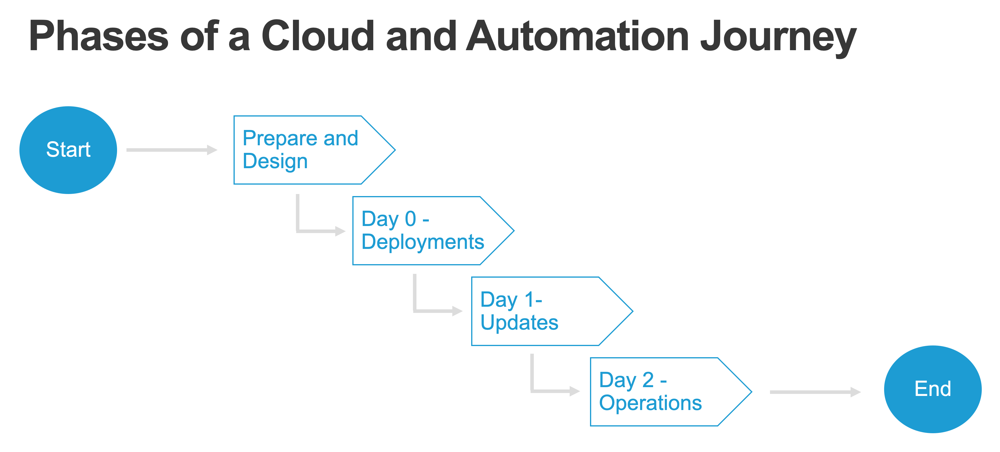
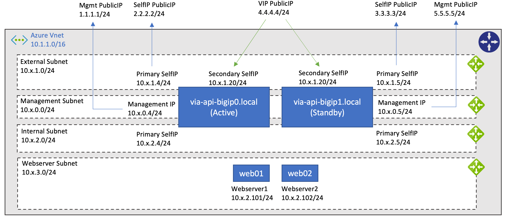
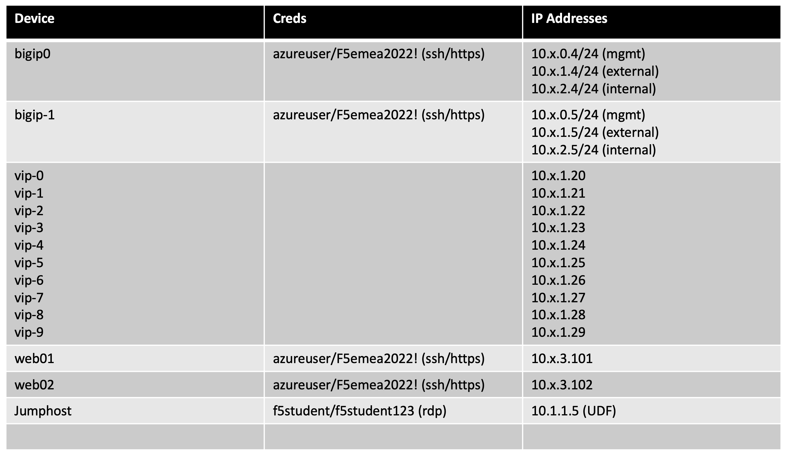

# Deploy Cloud and Automate with F5 BIG-IP

## Introduction

The created content includes pratical use cases which will help to gain insights when deploying F5 BIG-IP into cloud and want it to become part of the automated eco-system.

From the workshop use cases you will learn:
* Prepare and Design: Discussed through the workshop presentation.
* Day-0: Provision a BIG-IP or a set of BIG-IPs in cloud through automation
* Day-1: Deploy and modify applications
* Day-2: Operate BIG-IP through visibility, updates and upgrades



## How to use
This workshop uses the **F5 UDF Lab** to ramp up a jumphost which enables the student to deploy a full lab depolyment into Azure. UDF will provide a jumphost which has all the tools installed to deploy the infrastructure environments.

When you don't have access to UDF but want to leverage the provided material, you can use your laptop which should have the following tools installed:

* Web browser
* Terraform
* Azure CLI
* Visual Code Studio
* F5 VSC plugin

## Deployed Environment
The Terraform Infrastructure as Code deployment will setup an environment in Azure of two BIG-IPs which will act as a cluster for the duration of this lab.




```
Note:
Terraform defines the public and private IP associated to the selfIPs dynamically. Slight chance the assigned private selfIP addresses are different.

- The 10.x... will be determined by the student number you will get provided. 
- The secondary private IPs of the VIP addresses are statically assigned.
- Webserver private IPs are statically assigned.
```



[PREVIOUS](../README.md)      [NEXT](module_1/module_1.md)

