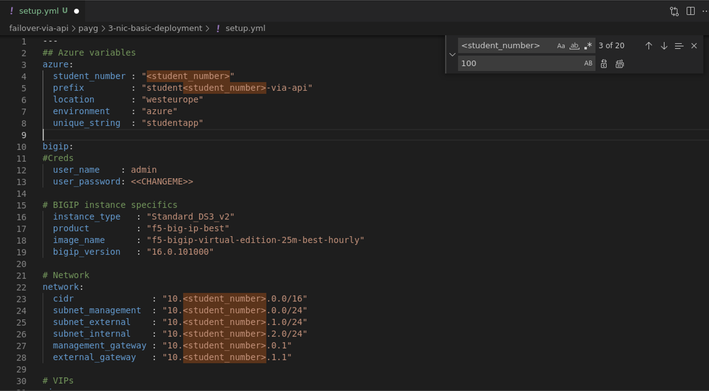

# 1.1 - Explore and start the lab environment for UDF users

```
Note:
Non-UDF users can skip this section ans go straight to task1.2 which is about peparing Postman*
```

**Step 1:** From UDF, start an RDP session to the Jumphost. For modern laptops it might be a suggestion to use the 1440x900 resolution to keep things readable in the remote session.


    
**Step 2:** In the Remote Desktop Connection popup select **‘Connect’**. Ignore the warning that the identity could not be verified and click **‘Yes’**.

**Step 3:** Login to Ubuntu with **f5student/f5student123**.


**Step 4:** Ignore any authentication pop-up by pressing **Cancel**.

**Step 5:** At the desktop, select **‘Activities’** in the upper left corner and select 

from the menu on the left. This will start Visual Studio Code.

**Step 6:** When no Terminal is shown, go to ‘Terminal’ and select **‘new Terminal’**.
 


This will open a Terminal window in the lower section of VSC.

**Step 7:** In this terminal, which is bash based type:

**git clone https://github.com/gwolfis/cloud-automation-workshop.git**

This grabs the files we will going to use for the lab from Github and places them on the Jumphost.


**Step 8:** Let’s open the folder in VSC, by selecting 

in the left pane and in the Home directory select **cloud-automation-workshop > failover-via-api > payg > 3-nic-basic-deployment** and click **‘OK’**.


The folder contains all the files to fire up the infrastructure in Azure public cloud by using terraform.


This workshop is built by using HashiCorp Terraform (https://www.terraform.io/) which is an open-source infrastructure as code software tool. Having a basic understanding how Terraform works will be beneficial for this course to better understand the taken steps, but if you don't have this knowledge, following the steps will get you through. Just take your time to understand what is happening.

**Step 9:** In the terminal section, be sure you are in the directory **3-nic-basic-deployment** and type the following and press enter:

**cp setup_changeme.yml setup.yml**

**Step 10:** Select **‘setup.yml’** and in the file select **<student_number>** and right-click and select **‘Copy’**.



**Step 11:** Type **‘Ctrl+H’** to search and replace the label into your actual student number. This has been assigned to you when being in the workshop. The picture shows ‘100’, but this **'most'** be your assigned student number! And click to replace it either at once or piece by piece to understand what you are replacing.

**Step 12:** As a result, you should see that everywhere the label **<student_number>** is replaced by **‘<your_assigned_student_number>’**. This counts for the student_number, and all B-octets of defined IP ranges and IP host addresses.

**Step 13:** Don't forget to **'CHANGE'** the user_password into a strong password like eg. 'F5emea2022!' or a strong random password and make sure yhou store it somwhere.

**Step 14:** Close the search and replace window and save the changes by pressing **‘Ctrl+S’**. Not saving the changes will make terraform fail!

**Step 15:** Before we can startup the infrastructure via Terraform we need to copy folder **files**.

1. At the Jumphost select **Activities** and select **show applications** from the left pane and select **files**.


2. Copy the folder **files**


3. In **files** select **cloud-automation-workshop > failover-via-api > payg > 3-nic-basic-deployment** and **paste** folder **files**.

4. When folder **files** is pasted into folder **3-nic-basic-deployment**, you can close the 'files' window.


**Step 16:** In the terminal type: **terraform init**
 


You should see this output.

**Step 17:** Next, type: **terraform plan**

**Step 18:** Finally type: **terraform apply -auto-approve**

Terraform will take about ~10min to deploy the infrastructure. Time for coffee!
* After ~3 minutes you will see underneath output.
* After ~10 minutes the BIG-IPs are up and clustered.

After the 3 minutes you can login, but don't touch anything, otherwise you will disrupt the deployment process.


When all is deployed, you should see this output.

```
Note: 
Public IPs will be different
```

[PREVIOUS](../module_1/module_1.md)      [NEXT](../module_2/module_2.md)