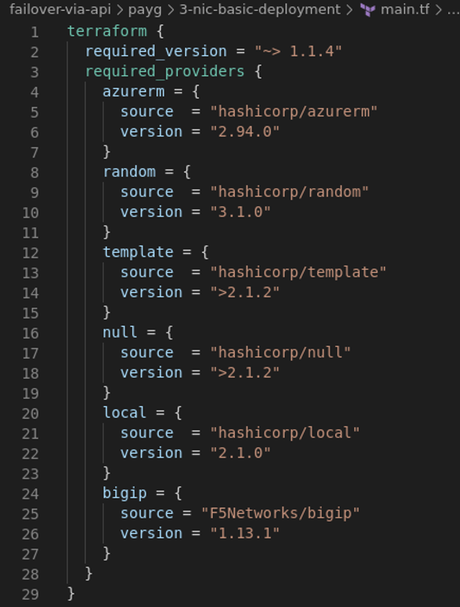

# 2.1 - Automation through Terraform

In the previous module we made use of Terraform to deploy BIG-IPs in Azure. So, what is Terraform?

## What is Terraform?
HashiCorp Terraform is an infrastructure as code tool that lets you define both cloud and on-prem resources in human-readable configuration files that you can version, reuse, and share. You can then use a consistent workflow to provision and manage all of your infrastructure throughout its lifecycle. Terraform can manage low-level components like compute, storage, and networking resources, as well as high-level components like DNS entries and SaaS features.

## How does Terraform work?

Terraform creates and manages resources on cloud platforms and other services through their application programming interfaces (APIs). Providers enable Terraform to work with virtually any platform or service with an accessible API.

The core Terraform workflow consists of three stages:

* Write: You define resources, which may be across multiple cloud providers and services. For example, you might create a configuration to deploy an application on virtual machines in a Virtual Private Cloud (VPC) network with security groups and a load balancer.
* Plan: Terraform creates an execution plan describing the infrastructure it will create, update, or destroy based on the existing infrastructure and your configuration.
* Apply: On approval, Terraform performs the proposed operations in the correct order, respecting any resource dependencies. For example, if you update the properties of a VPC and change the number of virtual machines in that VPC, Terraform will recreate the VPC before scaling the virtual machines.

The Terraform workflow has three steps: Write, Plan, and Apply.

The power of Terraform is really in the more than 1700 providers and still growing which have been developed to support infrastructure as code for clouds and vendors to get their assets automatically deployed.

**Step 1:** Go to the folder section on the left of Visual Code Editor and select the folder **'main.tf'**.

This section starts with formulating the required Terraform version and required providers.

**Step 2:** Check your used version of Terraform and the resources deployed. Type the following cmd in the VSC terminal.

**terraform -version**

For this workshop we will stay with terraform for deploying our infrastructure.

## Developed structure
When you come across more Terraform examples you will find that there are many ways to organize Terraform scripts. Some are more advanced then others, the goal throughout this workshop will be to stick with an 'easy' approach, so you should be able to follow allong. 

The files included in provisiong Terraform are:
* main.tf - includes Terraform required software version, providers to deploy in Azure and on BIG-IP. Generic objects like storage and identity.
* variables.tf - normally this is the place where all variables are documented, for the lab the variables are all put into a **setup.yml** and made local to have them available all the exercises.
* output.tf - Shows defined output as information once Terraform has finished the deployment.
* network.tf - The network section defines CIDR and subnets
* security.tf - Here are the defined security groups located
* bigip1.tf and bigip2.tf - for each BIG-IP a separate file has been created for the sake of clarity. Yes, you can put everything into one file. Both BIG-IPs make use of the **onboard.tpl** to include user data which will get explained in more detail in the next task.
* webservers.tf - Two webservers are defined based on Ubuntu 18.04. The user data section shows what gets included after the VM deployment.

**Step 3:** Type the following command in the VSC terminal:

**terraform graph | dot -Tsvg > graph.svg**

Open **graph.svg** by going to the Ubuntu Desktop and open **Activities**  and select **Show Applications**  

and then select  **files** 

and then select **cloud-automation-workshop > failover-via-api > payg > 3-nic-basic-deployment** and finaly select **graph.svg** to watch the graph and gain insghts in how Terraform creates the deployment.

## Terraform.tfstate

Terraform must store state about your managed infrastructure and configuration. This state is used by Terraform to map real world resources to your configuration, keep track of metadata, and to improve performance for large infrastructures.

More details or further read: https://www.terraform.io/language/state

[PREVIOUS](../module_2/module_2.md)      [NEXT](../module_2/task2_2.md)
