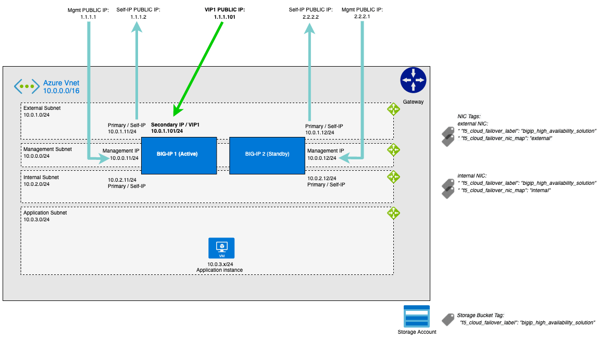

# 2.2 - Automated BIG-IP Design Deployment

Topics which will get discussed in this section are:
* BIG-IP automated deployment
* Cloud Failover Extension
* BIG-IP walk through


## BIG-IP Deployment

The Terraform defined scripts create two BIG-IPs setup as **Failover-via API** which is defined through the **Runtime-init** script. Runtime-init can be found in the **onboard.tpl and is the YAML defined section which includes:
* **runtime_parameters** - which are used to define the used parameters in this runtime script. These parameters can be dynamically fetched from Terraform, Azure Metadata Services (http://169.254.169.254/metadata) or statically defined.
* **extension_packages** - Here you define which F5 Automation Toolchain (ATC) .rpm packages you want to download and get installes on BIG-IP.
* **extension_services** - In this section you define the different configurations of Declarative Onboarding (DO) and Cloud Failover (CFE)

**Task 2.2.1:** Take an onboard.tpl defined variable and try to follow it how it gets defined. Do this for AS3_URL and HOST_NAME.

### Runtime-Init
F5 BIG-IP Runtime-init is a tool that simplifies startup scripts for BIG-IP Virtual Edition by providing a single convienient YAML or JSON based configuration which:
* Can include F5 ATC packages and configuration.
* renders secrest from public cloud vaults.
* renders runtime variables from emtadata services.

It creates a complete overlay which makes it cloud-agnostic and can be used with cloud-native templates of AWS, Azure and GCP, but also be used with Ansible or Terraform. Further reading and more details aboutF5 BIG-IP Runtime-init can be found here: https://github.com/F5Networks/f5-bigip-runtime-init.

**Task 2.2.2:** Go through **onboard.tpl** and try to understand what gets configured on the BIG-IP.

Questions you should answer:
* Which F5 ATC packages are getting downloaded and installed?
* Which F5 ATC servcies are being configured through runtime-init?
* What is being used to sync the BIG-IPs?

## Failover-via-API

Terraform deployed two BIG-IPs which are designed as a cluster using **Failover-via-API**. This setup delivers two BIG-IPs which does not need an upfront device to get traffic forwarded to the BIG-IP Virtual Servers. Failover-via-api comes closest to the **active - standby** use case which is mostly used at the on-prem situation and from where migration towards public cloud mostly happens. This design allows a 1-to-1 migration scenario from on-prem and this makes that it is commonly used, though you can argue because it is not the most 'cloud-native' design.



In an on-prem situation we would have used GARP to support failover, but GARP is a Layer 2 protocol and public cloud does not support Layer 2 functionality.

```
Disclaimer:
The fact that the BIG-IP design deployment 'Failover via-api' is being used throughhout his workshop is not a claim this is the 'F5' preferred design. F5 offers several designs through CSTv2 templates which all support of delivering F5 application services in their own respected way
```

F5 BIG-IP is able to communicate with te public cloud API backbone by using **Cloud Failover Extension (CFE)** that provides L3 failover functionality in cloud environments by triggering the cloud API. Without the use of CFE the BIG-IPs would act as a host on top of Azure public cloud and they wouldn't know from each others existence.

### Cloud Failover Extension
In short, CFE includes a declarative JSON script, public cloud storage and managed identity with the right authorization. The JSON script includes definitions of the used:
* CFE used storage
* Failover IP: to define and update IP configs between NICs, updates public/private IP associations, and updates forwarding rule target instances.
* Failover Routes: Updates Azure UDR, AWS route table and GCP forwarding rule targets to point to a selfIP address of an active BIG-IP.
* Failback: Reverts back to the designated primary BIG-IP when it comes active again.

CFE makes use of tags or labels wihch are attached to cloud resources, like storage and interfaces to understand which objects are involved in the failover process and keeps state in a file stored on the public cloud environment to ensure proper failover happens. The definition of JSON declaration can involve tags or labels to dynamically discover or static defined values for failover IP and failover routes

**Task 2.2.3:** Go through **onboard.tpl** once again and checkout the CFE portion of the script starting at **'extensionType: cf'**.

Question:
* What is the value of the 'f5_cloud_failover_label'?

**Hint:** You can find it by using the same method as in task 2.2.1 or go to your Azure Portal and look for the tag being used. btw. do you remember from the previou text where this label is attached to? (Yes, we haven't gone through Azure Console yet...;-)

Using Cloud Failover Extension has three main benefits:

* Standardization: Failover patterns will look similar across all clouds.
* Portability: You can leverage a variety of methods, including cloud-native templates, Terraform, and Ansible, to install and run CFE.
* Lifecycle and Supportability: You can upgrade BIG-IP without having to call F5 support to fix failover.

You can read and explore more of Cloud Failover Extension at F5 Clouddocs: https://clouddocs.f5.com/products/extensions/f5-cloud-failover/latest/userguide/overview.html#

[PREVIOUS](../module_2/tas2_1.md)    [NEXT](../module_2/task2_3.md)