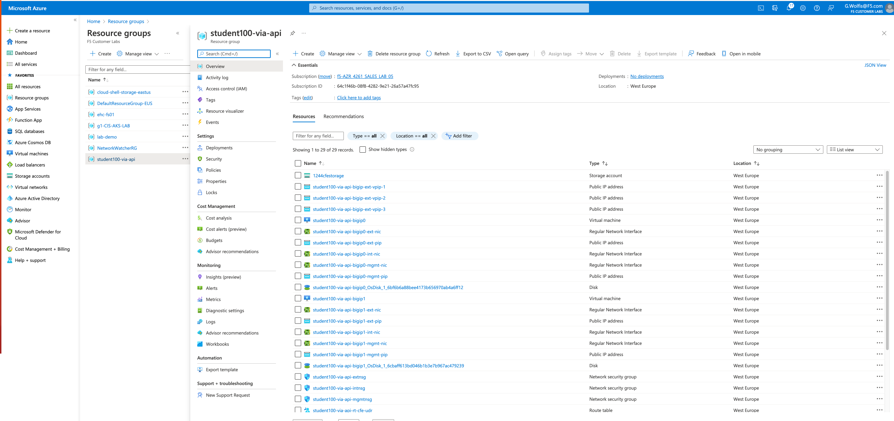
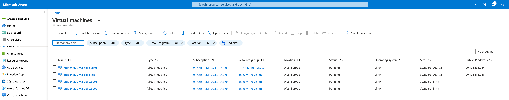
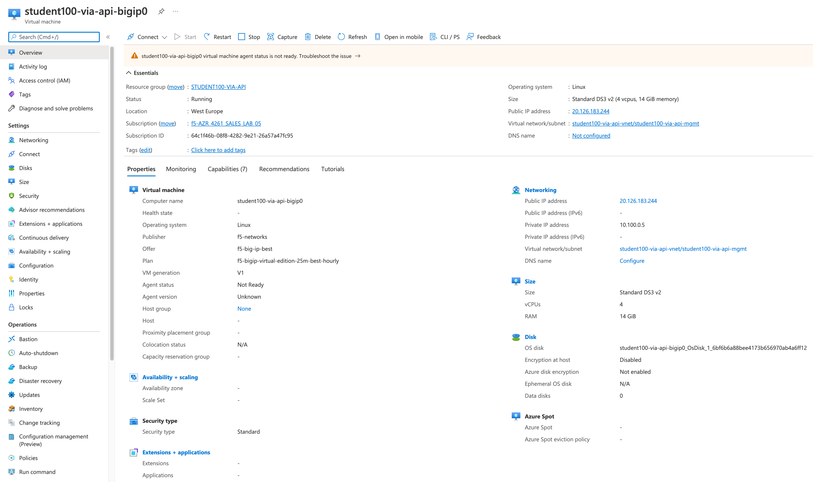
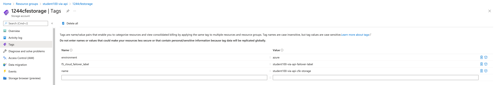
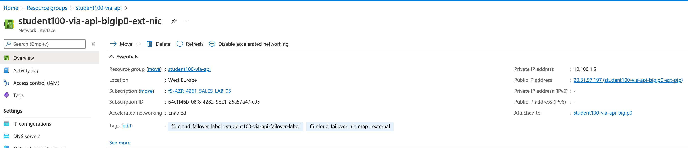
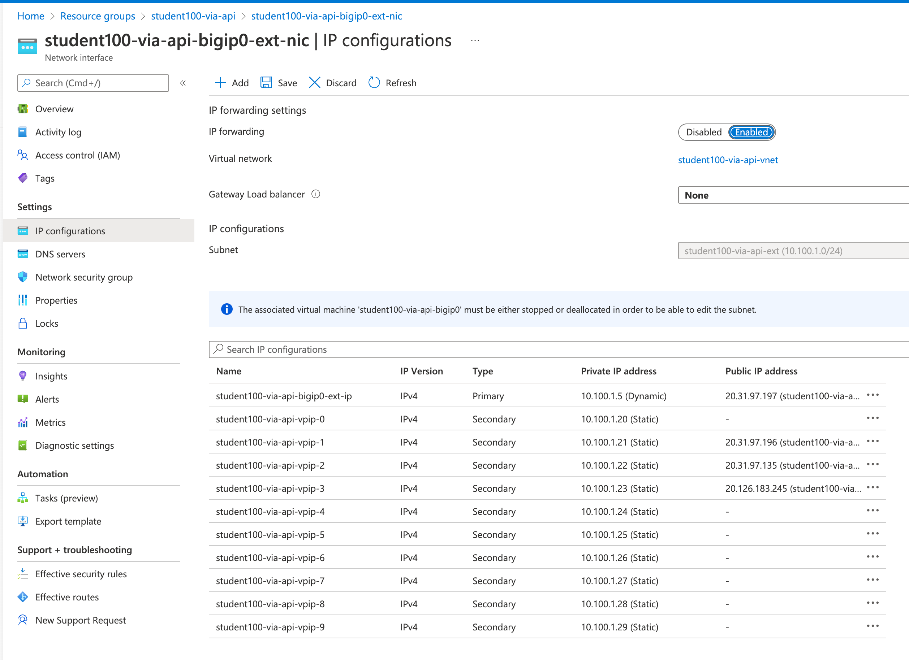

# 2.3 - Exploring BIG-IP in Azure

With the gained insight how things got deployed, let's get more specific about the way the BIG-IPs got setup in Azure. This section will not explain Azure in detail but more how the environment has been setup to create the deployments and dependancies.

**Step 1:** Go to the **Azure Portal** and select **Resource Groups** at the left side and select **YOUR** Resource Group defined by your student number to get a complete view of all deployed objects. Just release this is all done through 'one-click of a button'.

**Step 2:** At the **Left Pane**, select Virtual Machines and you should have an overview of your Virtual Machines. Use you **student number** to filter the results and get only your deployed VMs.

**Step 3:** Select one of the BIG-IPs and check out what has been defined and deployed for this Virtual Machine.

* Check the associated public IP address with what the Terraform Output delivered.
* Compare the values against the BIG-IP section **setup.yml** and you see that the deployed instance and product is coming from your Terraform definition.
* Check the related **bigip.tf**, go to the virtual machine section and compare/check how things got defined.

**Step 4:** Let's go back to the Resource Group Section and select the **'....cfestorage'** and select **Tags**.

You will find three tags and two of them are Cloud Failover Extension related. the CFE storage is being used to store the failover state and JSON declaration.

**Step 5:** Go back to the resource group and select a BIG-IP nic external interface (eg. student100-via-api-bigip0-ext-nic) (**note:** your student number will be different!)

Question:
* What is the value of Accelerated Networking? What does this mean? (lookup at Azure usig your browser)
* What are the tags associated with this external interface?
* What has the bigip0-int-nic **f5_cloud_failover_nic_map** tag defined as its value?

**Step 6:** Stay at the Interface pane but now select **IP configurations** and check what has been defined.

Notice the following:
* IP forwarding is set to enabled
* IP configuration has allocated one primary IP address which is related to the BIG-IP selfIP.
* The secondary IP configurations are there to support Virtual Servers.

Question:
* Some secondary IP configurations have an public IP to private IP association. What does not having a public IP having associated imply?

**Step 7:** Let's go back to our resource group and search for **Route Table** by going through the column **Type** and select it.

It shows the defined route which is part of the CFE JSON declaration and also the defined tags.
Checkout the tag **self_ips** key/value pair and notice that it includes the internal selfIPs of both BIG-IPs

The BIG-IP Virtual Servers will be used throughout the next modules and also the use case of failing over will be in an upcomming module.

[PREVIOUS](../module_2/tas2_2.md)      [NEXT](../module_3/module_3.md)