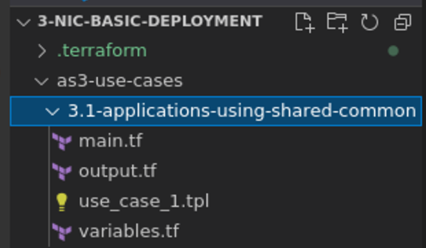
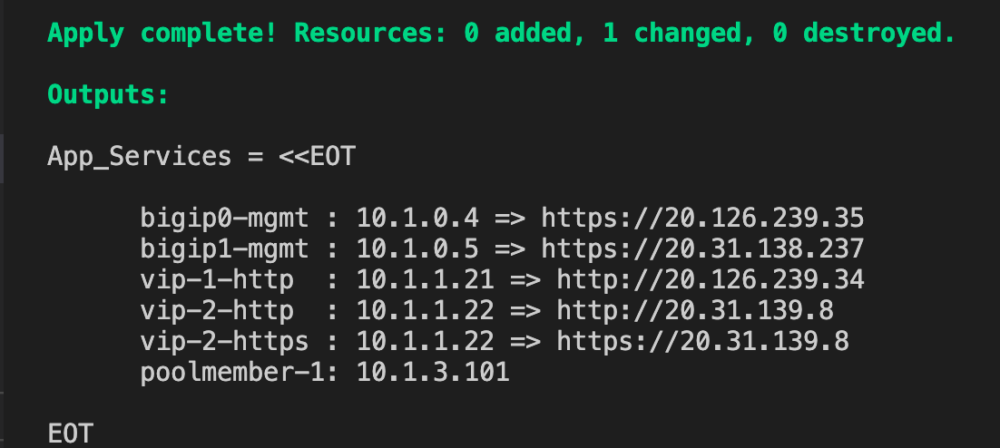
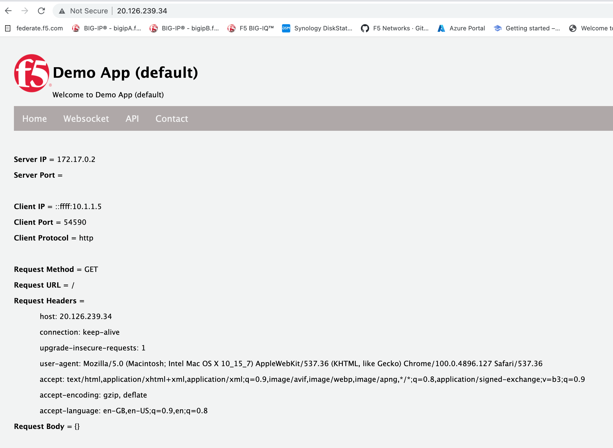
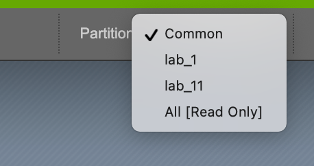
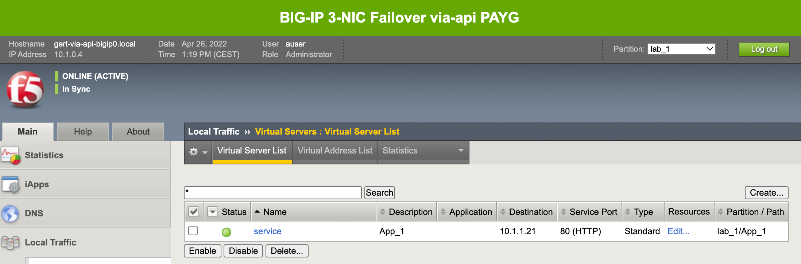
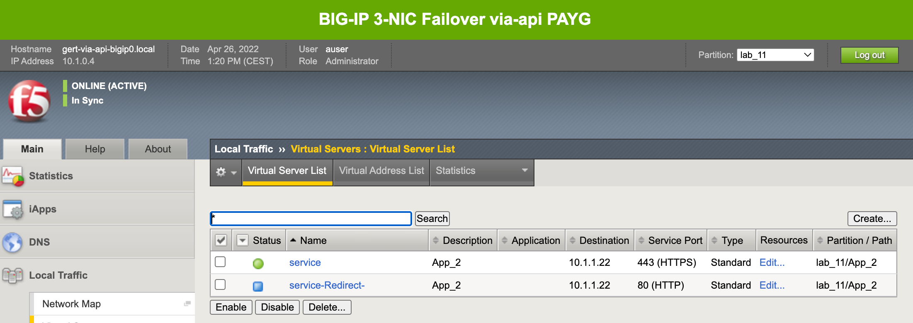
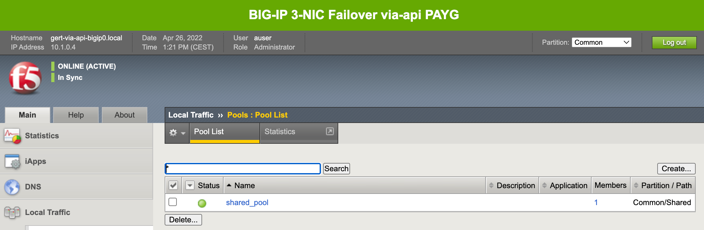
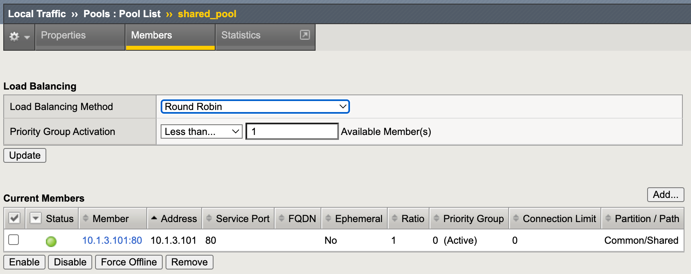

# 3.1 - Applications using shared /Common

## Use Case
F5 BIG-IP configuration has setup historically within partion common and starting to move into the API deployment approach through F5 Automation Toolchain and AS3 in particular, new applications will get deployed within their own tenant, but need to use objects in partion /Common.

Terraform is used to create the AS3 declared applications by using the bigip provider.

**Step 1:** Open Visual Studio Code (VSC) and open folder **3-nic-basic-deployment > as3-use-cases > 3.1-applications-using-shared-common**.

**Step 2:** Select **use_case_1.tpl** and watch the AS3 declaration carefully.

Questions:
* How many Tenants are getting deployed?
* Where does the pool get deployed?
* What is the IP address of the poolmember getting declared?

**Step 3:** Select **main.tf** and check the declared Terraform code.

Notice:
* Use of 'locals' to include variables from the setup.yml and hostname.
* The declared BIG-IP provider: https://registry.terraform.io/providers/F5Networks/bigip/latest/docs.
* Use of the data source to get the bigip0 management and vip public IP address.
* Use of resource bigip_as3.

**Step 4:** In VSC terminal go to the use case folder. From the **3-nic-basic-deployment** go to:

**cd as3-use-cases/3.1-applications-using-shared-common/** (if you already haven't done so).

**Step 5:** Deploy the declaration by typing the following in the VSC terminal:

* **terraform init**
* **terraform plan**
* **terraform apply -auto-approve**

**Step 6:** Watch the generated Terraform output and use vip-1 and vip-2 to test the deployed applications.

Check application vip-1:

Check vip-2, it will have the same output.

**Step 7:** Go to the BIG-IPs by using the and login via the GUI and check the deployed AS3 declaration.

Check the deployed partitions:

Check the Virtual Servers per partition:

Finally checkout the pool and poolmember:

Notice that when checked through the created partitions the pool config is greyed out, because it is being deployed in /Common.

**Step 8:** Don't delete the AS3 deployed applications.

## Use Case Summary
AS3 is capable of using /Common as a shared partition and allows someone to declare 'shared' objects where different applications, declared in different tenants can use these shared objects.

Changing the configuration of an object in /Common will effect all applications which use this object.

[PREVIOUS](../module_3/module_3.md)      [NEXT](../module_3/task3_2.md)