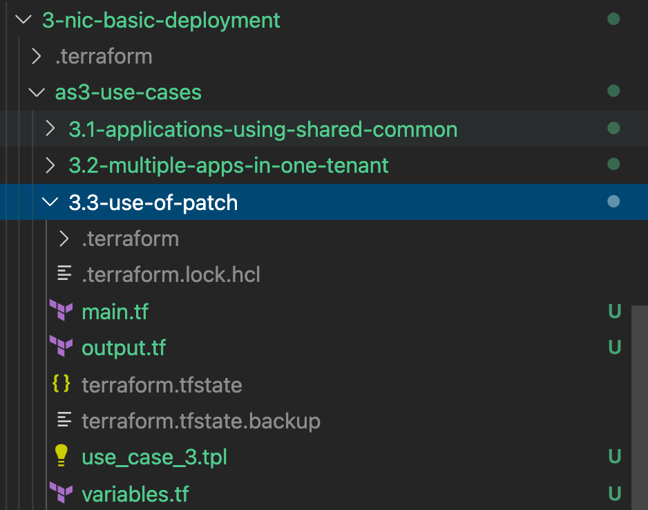
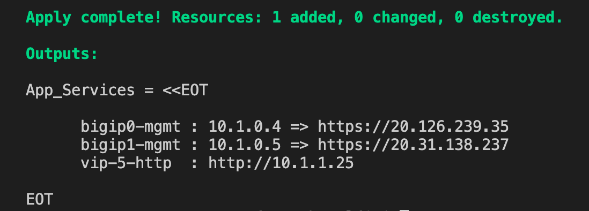
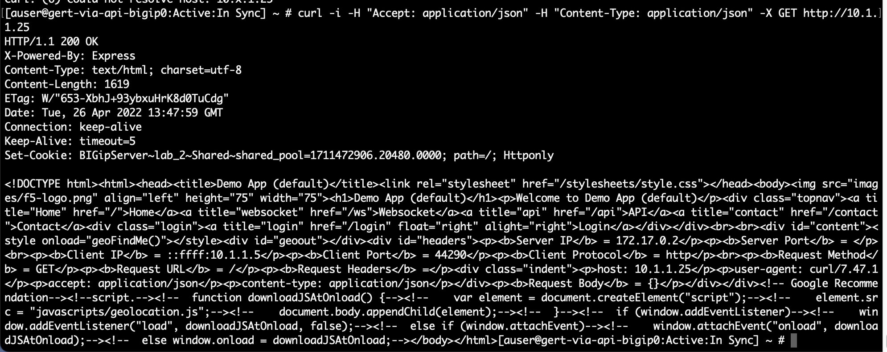
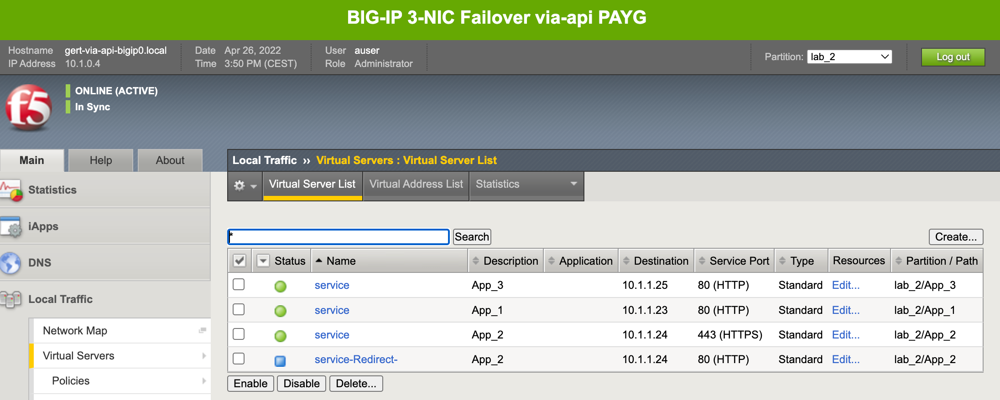
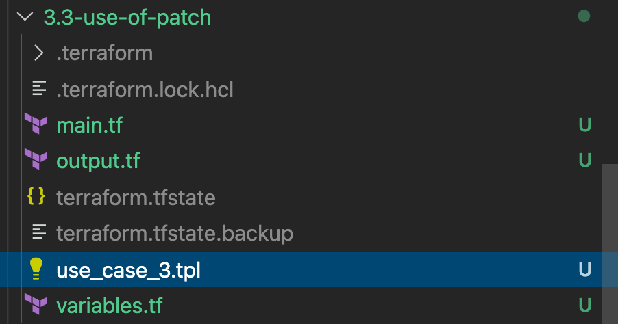
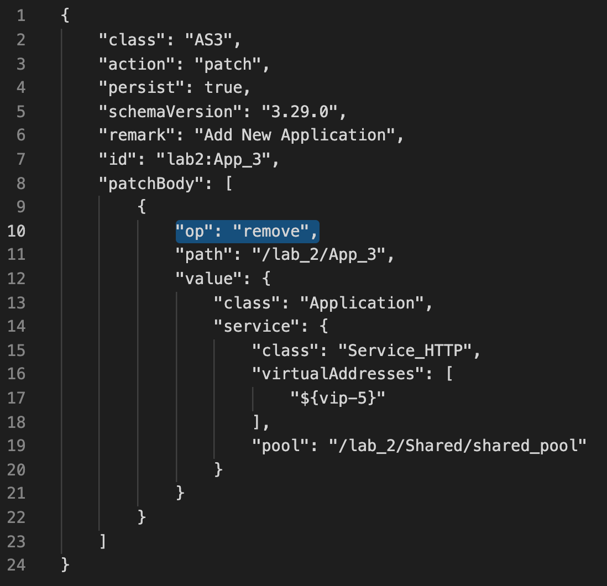
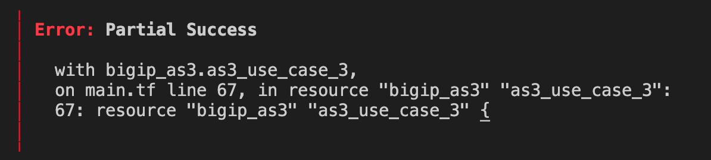

# 3.3 - Use of Patch

When you look into the supported HTTP methods of AS3 you will see that besides GET, POST and DELETE also PATCH is allowed to be used.
The big difference between POST and PATCH is that you will not sent the entire declaration as with a POST, but just an additional portion relevant to support the modification. That feels more light-weight, right?
PATCH can be used for modifications like enabling/disabling a poolmember, change a parameter like a pool health monitor or add a WAF policy.

From the AS3 best practices it is written that it is preferrable to overwrite instead of add. Using PATCH over POST breaks the declarative model where your declaration should be your single source of truth.

## Use Case
The ADC admin gets tasked with adding another application to an existing tenant. The admin ADC desides to use PATCH to accomplish the task.

**Step 1:** Open Visual Studio Code (VSC) and open folder **3-nic-basic-deployment > as3-use-cases > 3.3-use-of-patch**.

**Step 2:** Select **use_case_3.tpl** and checkout the AS3 declaration.

Notice:
* PATCH makes use of a **patchBody**.
* "op" stands for operator and this declaration adds application App3 in tenant lab_2.
* The application will make use of the same shared pool in tenant lab2.

**Step 3:** Select **main.tf** and check the declared Terraform code before going to step 4.

**Step 4:** In the VSC terminal, go to the use case folder:**3.3-use-of-patch**.

**Step 5:** Deploy the declaration by typing the following in the VSC terminal:

* **terraform init**
* **terraform plan**
* **terraform apply -auto-approve**

**Step 6:** Use the generated output to test vip-5.

VIP-5 does not include an associated public IP address, so let's tested via SSH.
* Login to a BIG-IP with SSH
* In BIG-IP from the Shell cmd, **curl -i -H "Accept: application/json" -H "Content-Type: application/json" -X GET http://10.x.1.25**

**Step 7:** Check on BIG-IP GUI that the app got deployed by selecting partition **lab_2** and watch for **App_3**.

## The Use Case Continues...
So far, things don't look too bad. The extra application got deployed by using PATCH and all is working. 
The ADC admin gets a phone call to immediately delete App_3 since the responsible department wasn't ready yet.

Since we used PATCH, let's use it this time to delete App_3 from tenant lab_2.

**Step 8:** Go back to the **use_case_3.json** in the left pane of VSC and open it.

**Step 9:** In the **patchBody** change to **"op": "remove"** and save the change with **Ctrl+s**.

**Step 10** Redeploy Terraform, in VSC Terminal type **terraform apply -auto-approve** and watch it getting processed.

When the process is finished you should see "Error: Partial Success".

Question:
* Did application **lab_2/App_3** get removed? (Check the BIG-IP)

**Step 11:** App_3 can stay on the BIG-IP.

## Use Case Summary
Never use PATCH over a POST. Overwritting creates a declaration which is a single source of truth.
AS3 PATCH has been used in combination with Terraform throughout this exercise. Remember that Terraform is a declarative automation tool and does not expect a PATCH method, but always a POST because this creates that the state file will always have the right status. The failure we have seen is caused by Terraform expecting a POST and not a PATCH. Yes, using another REST-API method would delete App_3 succesfully, but remember: "PATCH should never go over a POST".

[PREVIOUS](../module_3/task3_2.md)      [NEXT](../module_3/task3_4.md)