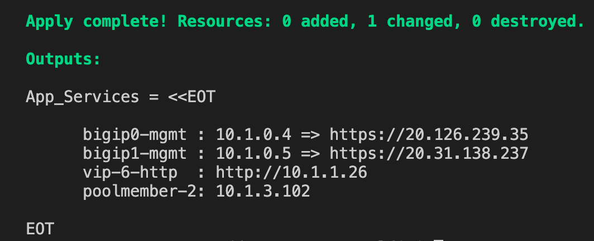
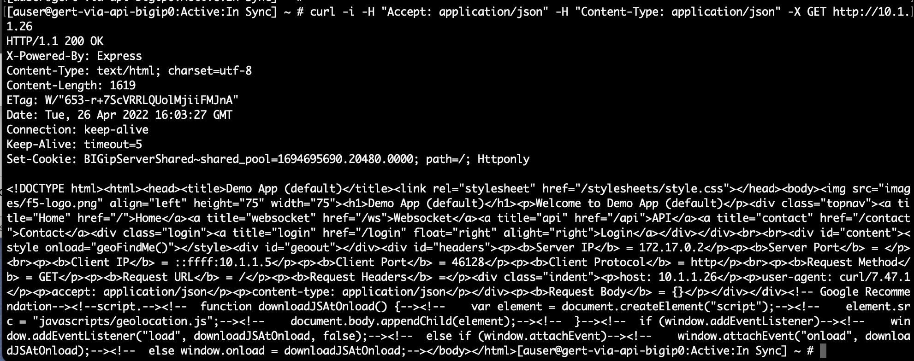
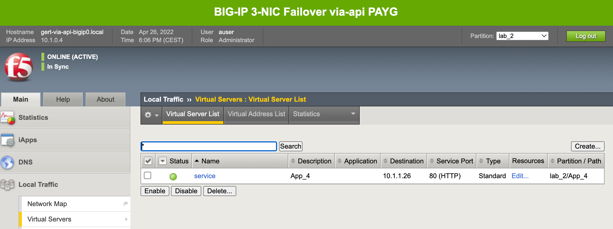

# 3.4 - Add application with POST

Frankly, we have been using the POST HTTP method during the deploymentsof task3.1 and task3.2. Maybe it wasn't noticed because instead of declaring via a REST-API client we used the BIG-IP Terraform provider. This bigip-as3 resource provider uses POST as its declaration method.

Let's experience to power of POST by going through next use case.

## Use Case
Another application needs to get deployed within the same tenant **lab_2**. The ADC admin has prepared the change in a hurry to get this application added to the current status quo.

**Step 1:** Open VSC at the left side and select the folder **3.4-add-app-w-post**.

**Step 2:** Select **use_case_4.tpl** and watch the AS3 declaration.

Question:
* With the previous lesson about PATCH and POST in mind what is likely goin to happen?

**Step 3:** In VSC terminal go to the use case folder. From the **3-nic-basic-deployment** go to:

**cd as3-use-cases/3.4-add-app-w-post/** (if you already haven't done so).

**Step 5:** Deploy the declaration by typing the following in the VSC terminal:

* **terraform init**
* **terraform plan**
* **terraform apply -auto-approve**

**Step 6:** Watch the Terraform output and use it to test vip-6 by using SSH.

* Login to a BIG-IP with SSH
* From the BIG-IP Shell command line:

**curl -i -H "Accept: application/json" -H "Content-Type: application/json" -X GET http://10.x.1.26**

(Where **x** is your student number)

**Step 7** Login on the BIG-IP GUI and check all the applications defined in partition **lab_2**.

Questions:
* Did your expectation in Step 2 became true?
* What happened to the applications?
* What is the root cause of only seeing **App_4**?

## Use Case Summary
POST = overwrite and by only declaring App_4 in the AS3 declaration we have just overwritten and deleted all the other deployed applications in tenant lab_2.

[PREVIOUS](../module_3/task3_3.md)      [NEXT](../module_3/task3_5.md)
