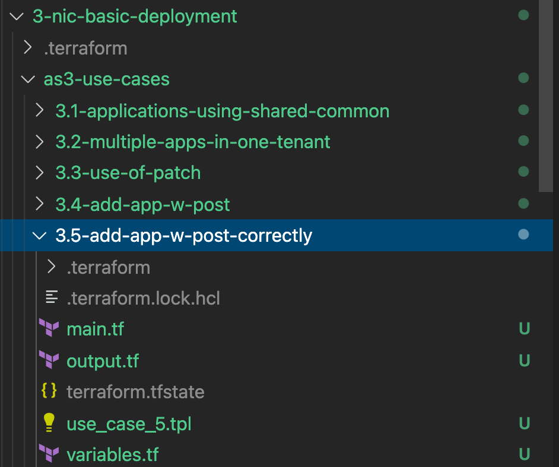
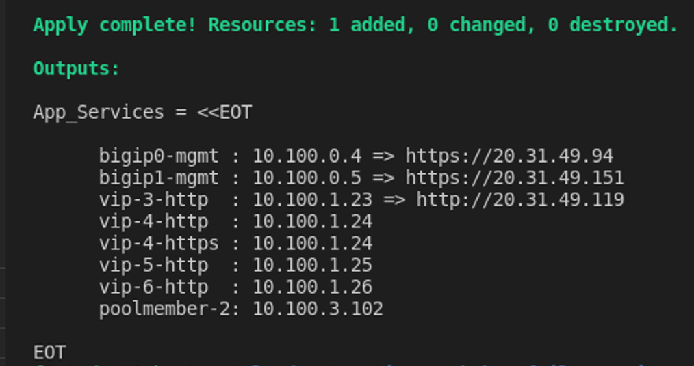
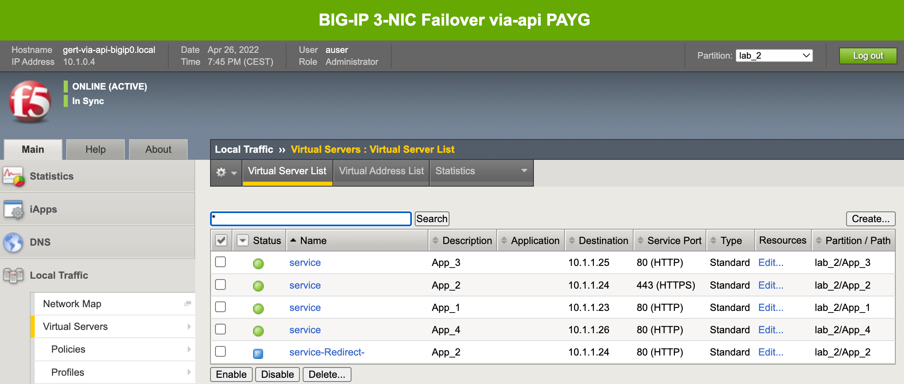

# 3.5 - Add applications with POST Correctly

Using POST with AS3 makes that with each modiufication you will declare the entire 
## Use Case
The ADC admin needs to correct its action from the previous use case and get all deployed applications back in tenant lab_2.
For this, an new enrollment got 'backed' and we will use this to get all apps back and get everyone back to peace.

**Step 1:** Open VSC at the left side and select the folder **3.5-add-app-w-post-correctly**.

**Step 2:** Select **use_case_5.tpl** and watch the AS3 declaration.

Question:
* With the previous lesson about PATCH and POST in mind what is likely goin to happen?

**Step 3:** In VSC terminal go to the use case folder. From the **3-nic-basic-deployment** go to:

**cd as3-use-cases/3.5-add-app-w-post-correctly/** (if you already haven't done so).

**Step 5:** Deploy the declaration by typing the following in the VSC terminal:

* **terraform init**
* **terraform plan**
* **terraform apply -auto-approve**

**Step 6:** Watch the Terraform output and use it to test the applications.

Testing:
* vip-3: Click the URL in the Terraform output
* vip-4: Use SSH to login a BIG-IP and perform
  
  * HTTP: **curl -i -H "Accept: application/json" -H "Content-Type: application/json" -X GET http://10.x.1.24**
  * HTTPS: **curl -isk -H "Accept: application/json" -H "Content-Type: application/json" -X GET https://10.x.1.24**

* vip-5 HTTP: **curl -i -H "Accept: application/json" -H "Content-Type: application/json" -X GET http://10.x.1.25** 

* vip-6 HTTP: **curl -i -H "Accept: application/json" -H "Content-Type: application/json" -X GET http://10.x.1.24**

**Step 7:** Login to the BIg-IP and check if all the apps in tenant **lab_2** are back.

## Use Case Summary
Changing a configuration or adding a new application with AS3 allways go with the POST HTTP method.

[PREVIOUS](../module_3/task3_4.md)      [NEXT](../module_3/task3_6.md)