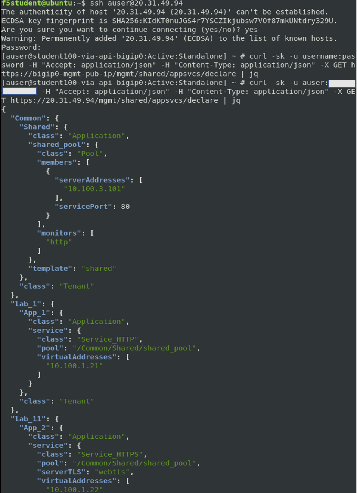

# 3.6 - Deleting Application Services

Once the lifecycle of an application ends it needs to get rermoved from the cloud environment to avoid pullotion of the configuration and increase security.
How has ever worked at operations knows that pullotion of assets from old configurations is a serious problem. I most cases no-one knows exeactly what is related to the application and when in doubt you don't want to remove because it might lead to a service outage. This 'old' configuration will stay there for years and can is a potential security breach since the configuration is not maintained anymore and no-one will pay attention here.

**Step 1:** Open VSC at the left side and select the folder **3.6-delete-application-services**.


**Step 2:** Let's get an overview of all the deployed applications by performing a GET.

Login BIG-IP with SSH and type:
**curl -sk -u username:password -H "Accept: application/json" -H "Content-Type: application/json" -X GET https://bigip0-mgmt-pub-ip/mgmt/shared/appsvcs/declare | jq**

* Fill in your username and password.
* Fill in management public IP address of one of the BIG-IPs 


(Omitted output)

**Step 3:** Scroll through the all the declared AS3 application services and try to read it.

Notice:
* AS3 GET https://{bigip-mgmt-pub-ip}/mgmt/shared/appsvcs/declare shows all declared AS3 deployments.
* Though still readable at this point imagine 100 declared applications or even more.

Let's start to deploy modifications to the existing AS3 declared application services.

**Step 4:** Select **use_case_6.tpl** and watch the AS3 declaration. Notice that it is the same template as the one we used in task 3.5.

**Step 5:** Let's delete **App_3** from tenant **lab_2** by selecting that portion of the defined configuration in the JSON template and remove it. Save the file after the change with **'Ctrl+s'**.


**Step 6:** With **App_3** being removed from the template it now needs to get redeployed. For this go to the VSC terminal and move to folder **3.6-delete-application-services**.

**Step 7:** Deploy the declaration by typing the following in the VSC terminal:

* **terraform init**
* **terraform plan**
* **terraform apply -auto-approve**

**Step 7:** Login to one of the BIG-IPs to check if **App_3** is being removed.


**Optional:** Use SSH to login to the BIG-IP and check the config by reusing the cURL cmd as used at Step 2.

**Step 8:** At this point we only removed the AS3 JSON part of **App_3**, look at **main.tf** and the associated **vip-5** is still part of the defined local variables. Let's remove it (selected part in below picture). Save the file after the change with **'Ctrl+s'**.


Finally we need to adapt the change to the Terraform output by removing that the **vip-5** entry in **output.tf**. 


Let's redeploy Terraform with **terraform apply -auto-approve** and watch the Terraform output.


**Step 9:** In the same way we can delete an entire Tenant. Open file **use_case_6.tpl** once again and remove all applications so we create an empty tenant. Below you will find from what should be left from the template file (or just copy and paste AS3.json as ahown here in the guide). Save the file after the change with **'Ctrl+s'**.

```
AS3.json:
{
    "class": "AS3",
    "action": "deploy",
    "persist": true,
    "declaration": {
        "class": "ADC",
        "schemaVersion": "3.0.0",
        "label": "LAB 2",
        "remark": "Two applications sharing a pool",
        "lab_2": {
            "class": "Tenant"
        }
    }
}
```

Notice:
* Terraform will return with an error "Error: Provider produced inconsistent result after apply". This issue is reported and tracked: https://github.com/F5Networks/terraform-azure-bigip-module/issues/14

* All applications and tenant are being removed, check the BIG-IP GUI.
* The comma (**,**) after **"class": "Tenant"** has been removed to be syntactically correct.

**Step 10:** Redeploy Terraform with **terraform apply -auto-approve** and login to the GUI of the BIG-IP and select the partitions section. Is **lab_2** Still there?


Though tenant **lab_2** is being removed from the BIG-IP, Terraform will return with an error as shown below. The error is reported as an issue on Github: https://github.com/F5Networks/terraform-provider-bigip/issues/620


**Step 10:** Another way to delete tenants is by using REST-API via cURL. Login via SSH into the BIG-IP and at Shell copy and paste underneath syntax and adjust it with you username, password and BIG-IP management public IP address. Press **Enter** when ready.

**curl -sk -u username:password -H "Accept: application/json" -H "Content-Type: application/json" -X DELETE https://bigip0-mgmt-pub-ip/mgmt/shared/appsvcs/declare/lab_11**

Question:
*Did partition/tenant **lab_11** get removed?


**Step 11:** Finally we will use one last cURL command to delete all declared AS3 deployments. At the BIG-IP Shell prompt reuse the previous cURL command and remove **/lab_11**.

**curl -sk -u username:password -H "Accept: application/json" -H "Content-Type: application/json" -X DELETE https://bigip0-mgmt-pub-ip/mgmt/shared/appsvcs/declare**

Login the BIG-IP GUI and:
* Check the partitions. You should only have /Common.
* In the Local Traffic section check if the shared-pool still exists.

This last method deletes **ALL** AS3 declared application services, handle with care!

[PREVIOUS](../module_3/task3_5.md)      [NEXT](../module_3/task3_7.md)