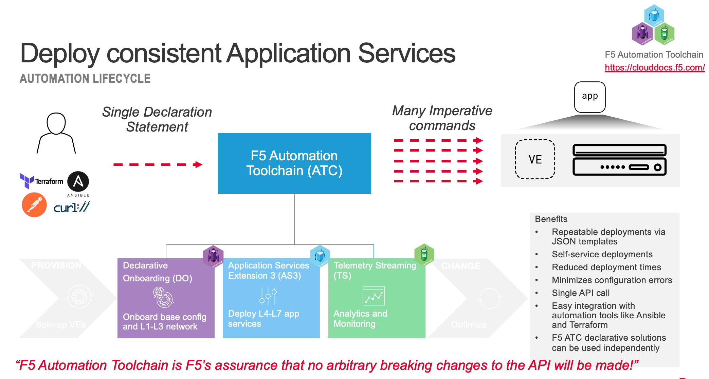

# 3.7 - Module 3: Use of AS3 Conclusion and Summary

Application Service Extension 3 (AS3) enables enterprises to use BIG-IP in an automated cloud environment to deploy L4 - L7 Application Services. The use of F5 Automation Toolchain including AS3 is not exclusively for BIG-IP Virtual Editions but can also be used to automatically deploy those applications services on F5 BIG-IP hardware systems.

## Application Services Extention 3
The shown use cases have delivered that one will use them with more insight and specially when migrating from an object-based configuration using /Common to using AS3 where applications will be deployed in tenants and move away from 'all-in" /Common.

* How Shared objects can be used among different AS3 declaared applications and even be part of a tenant and shared between apps within that tenant.

* Always remember that when changing these shared objects, those changes will reflect through all applications which are making use of that shared object.

* Never use PATCH where you should use POST otherwise your declaration will not be your single source of truth.

* The use of Delete via the Terraform BIG-IP provider is not straight forward but the same as you would use it via a REST-API client.

* When more and more configurations are getting deployed on the BIG-IP using AS3, maintaining them can become a challenging task.

[PREVIOUS](../module_3/task3_6.md)      [NEXT](../module_4/module_4.md)