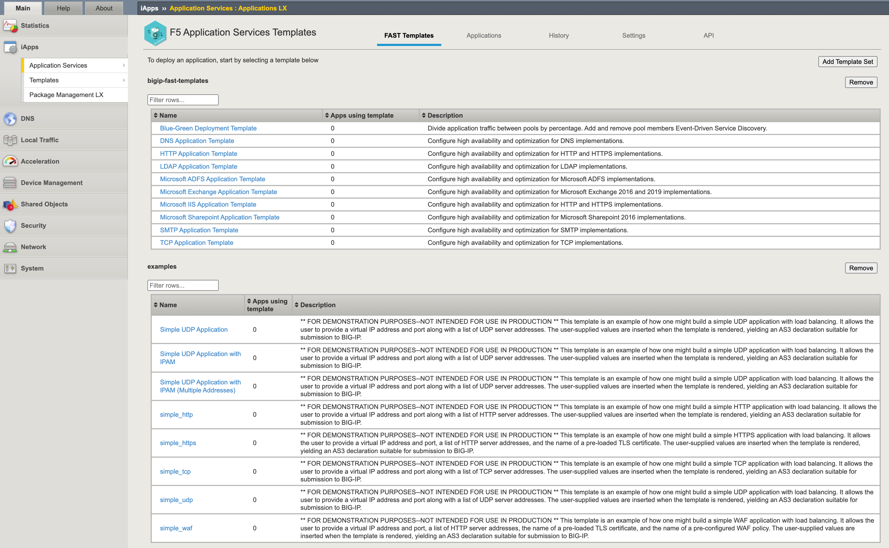
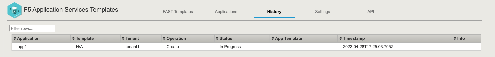

# 4.1 - Deploy Applications with FAST via the GUI

Let's explore FAST on the BIG-IP and start to make use of it to deploy simple applications in order to see how enterprises can benefit from using organized templates.

**Step 1:** Login to the BIG-IP GUI and check if the FAST .rpm package has been installed. Go to **iApps > Package Management LX** and look for **f5-appsvcs-templates**.

Questions:
*What version of **f5-appsvcs-templates** has being installed?
* How did all these .rpm package got installed on the BIG-IP?

**Step 2:** Login to the BIG-IP GUI and explore FAST by using the left pane and go to **iApps > Application Services > Applications LX** and select **F5 Application Services Templates**

**Step 3:** Go through the pre-canned templates to understand what out-of-the-box is available.

Questions:
* For what use case is the blue-green template usefull?
* Does the HTTP Application Template include the possibility to include WAF?
* Note: The **example** FAST templates are for demo purposes only.

**Step 4:** In the FAST window select **HTTP Application Template** and fill in the following values and click **Deploy**.

In the template it should look like this:

**Step 5:** Wait for the template to get deployed

In progress:

Template deployement succesfull:

Go tab **Applications**:

**Step 6:** Check the deployed configuration in the BIG-IP.

Check:
* The tenant where it got deployed.
* Client SSL got enabled
* If a application security policy got attached.

**Step 7:** Test the application via the GUI by using vip-1 public IP address.

VIP-1 public address can be found via several ways:
* Azure console by selecting **student#-bigip-via-api-bigip0-ext-nic** and then select the **IP Configuration** and look for the public IP address associated with 10.1.1.21.
* In the VSC terminal go back to folder **3-nic-basic-deployment** and type **terraform output**

[PREVIOUS](../module_4/module_4.md)      [NEXT](../module_4/task4_2.md)