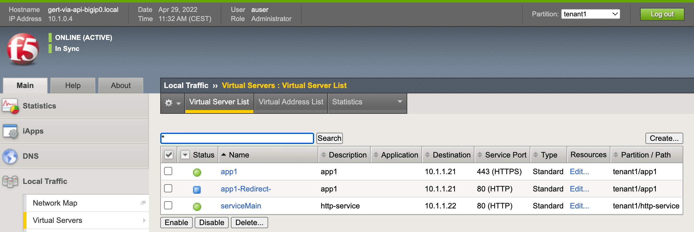

# 4.2 - Create multiple apps with FAST via API

Task 4.1 showed how FAST can be used through the GUI. The power of FAST is that it can be used either through the GUI or via API and the templates can be fully customized. AS3 is being used as the underlaying engine and delivers an easy way to create those custom templates and creating a standard solution fully based on JSON and REST-API which can get fully automated and become part of ondemand self-service via API.

## Use Case
The ADC admin has been tasked to setup multiple applications within the same tenant. Learned AS3 but curious about using FAST, decided to explore this potential further and using it to deploy new applications.

**Step 1:** In VSC left pane, scroll to the folder **fast-use-case** and open it.

**Step 2:** Select **4.1-create-http-via-fast.json** and compare the declaration with the **simple-http** fast template which can be found at the BIG-IP GUI.

Question:
* What can you conclude when comparing?

**Step 3:** For deploying FAST via API we will make use of the F5 Extension in VSC and therefore we first need to login into the BIG-IP. Select  and go to the **F5 Hosts** section and press **'+'** to add a BIG-IP.

In the opened field, fill in the BIG-IP **username@mgmt-pub-ip** and press enter and finally enter the password. You should see that the BIG-IP is connected.

Notice:
* Once the BIG-IP connects to VSC via the F5 Extension, the BIG-IP config gets read and shown in the left pane.

**Step 4:** Go back to file **4.1-create-http-via-fast.json** and check the JSON body and the declared Virtual Server and poolmember. Make sure the defined IP addresses are matching your defined CIDR and network octets. Align the given values with your **student number**.

**Step 5:** Once again select the file **4.1-create-http-via-fast.json**, select the JSON body and perform a right-click and select **Deploy FAST App**.

(Shown IP addresses will not be the same as yours, be sure to replace the B octet of the IP address with your **student number**)

Deployment of the FAST template will generate an **Untitled-1** json response.

**Step 6:** Check the deployed application on the BIG-IP via the GUI.

and:

## Use Case Summary
FAST allows for deploying applications via the GUI or API and delivers a way to standardize defined app services functions within pre-defined templates and which can be custom tailored.

[PREVIOUS](../module_4/task4_1.md)      [NEXT](../module_4/task4_3.md)
