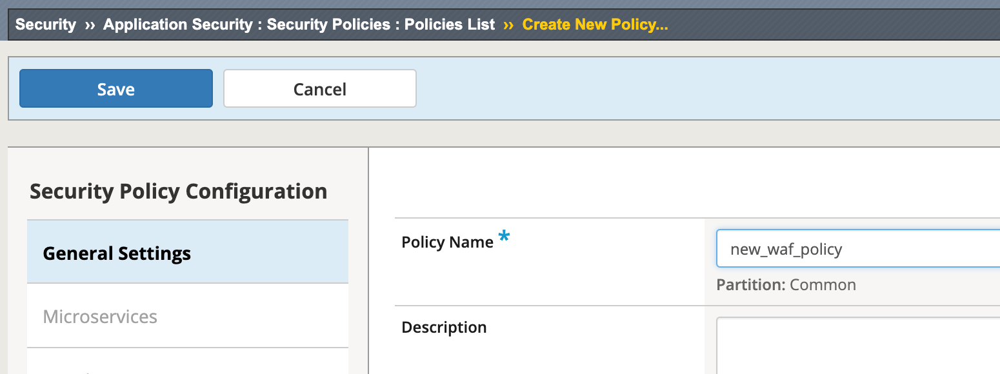
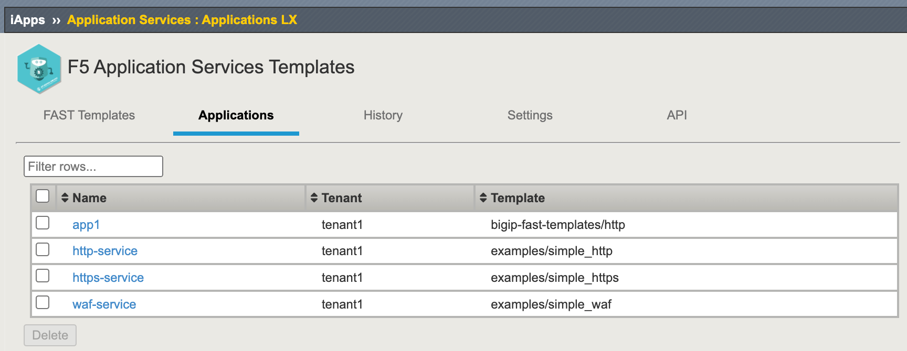
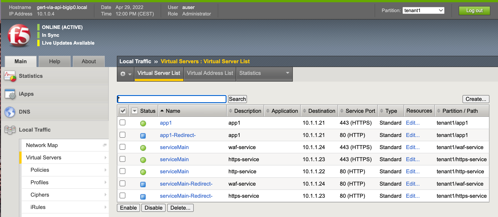
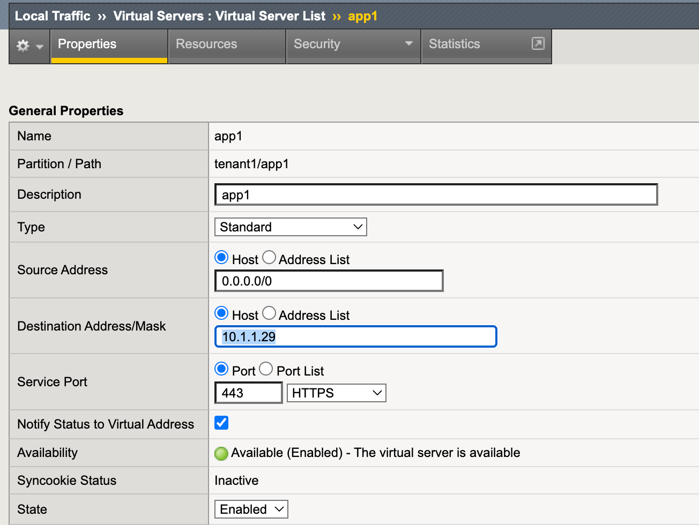
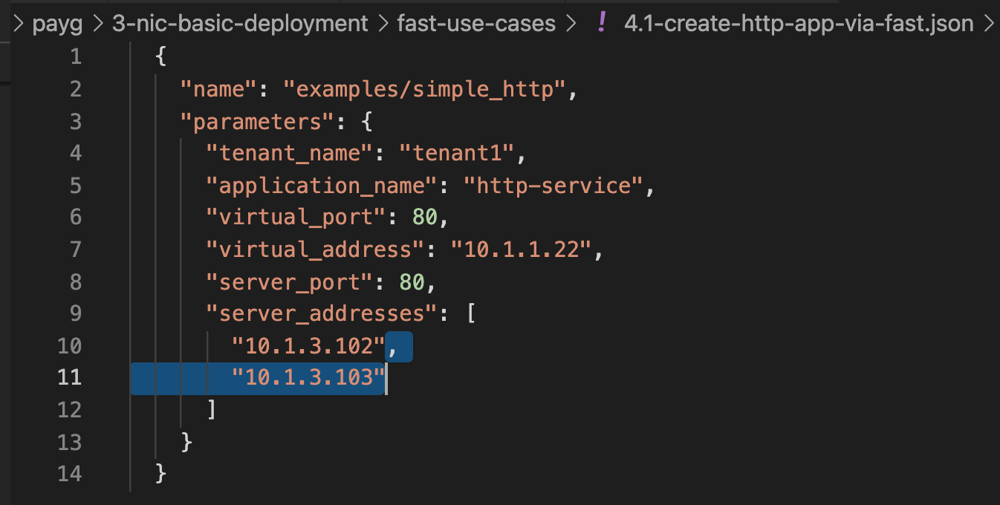
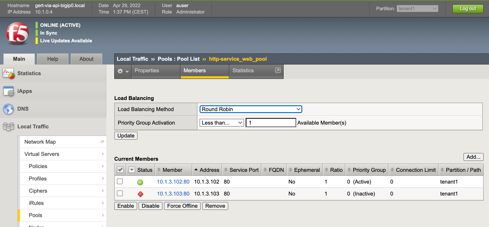
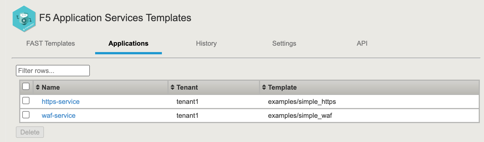
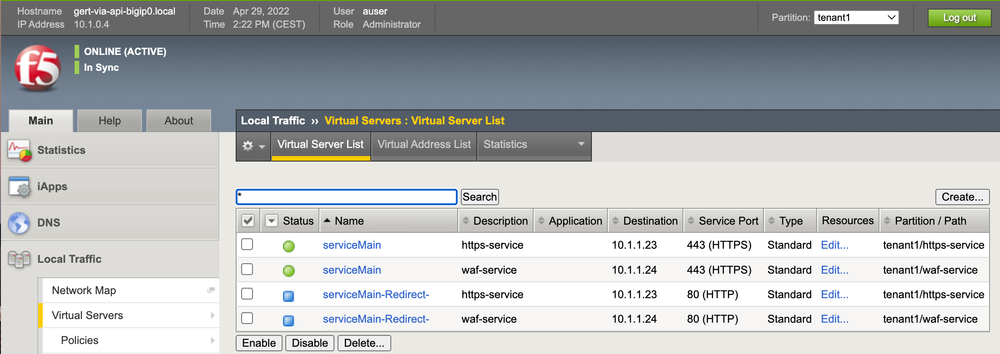

# 4.3 - Modify applications through FAST

Key aspect for day 1 modifications is the ability to add new applications and to change existing ones.


## Use Case
Satisfied with the result to create new applications by using FAST, the ADC admin continues deploying new applications using FAST. Existing application **http-service** needs modification.


**Step 1:** Before deploying the new applications with FAST you need to create a WAF policy on the BIG-IP via the GUI in partition **Common**. 

The **simple-waf** template , used in **4.3-create-https-waf-app-via-fast.json**, only supports the use of existing WAF policies in partition Common. Therefore, we need to create a WAF policy via the BIG-IP GUI first.

Go to parttition /Common, name the WAF policy **new_waf_policy** and hit **Save**.



**Step 2:** Repeat steps 3 and 4 for applications and use your **student number** to change the **IP address B octet** and save the changes with **Ctrl+s**:
* 4.2-create-https-app-via-fast.json
* 4.3-create-https-waf-app-via-fast.json
After deploying both apps you should have these views on the BIG-IP.

```
Note:
Make sure the defined IP addresses are matching your defined CIDR and network octets. 
Align the given values with your student number.
```



and



Note:
- HTTP, HTTPS and HTTPS+WAF service all use the same 'shared' poolmember.
- FAST can be used to deploy multiple apps within the same tenant.

**Step 3:** Login to the BIG-IP to modify **tenant1/app1** virtual server IP address. Go to **Local Traffic > Virtual Servers > app1** and change the **Destination Address/Mask** from `10.x.1.21` to `10.x.1.29` and hit **Update**.



Questions:
* Was the Virtual Server succesfully updated?
* Is this a good way of modifing an FAST or AS3 deployed app service?

**Step 4:** On the BIG-IP go the **F5 Application Services** section and from the **Applications** Select **App1** and check the configured Virtual Server IP address.

Change it from `10.x.1.21` to `10.x.1.29` and click **Deploy**.

**Step 4:** Go to VSC and select **4.1-create-http-app-via-fast.json** and add another poolmember like shown in the picture and save it (Ctrl+s).



**Step 5:** Deploy the 4.1 app services again by using the F5 VSC extension and check the result on the BIG-IP via the GUI.



The poolmember will show 'red' because there is no real node behind, it's just being defined for expanding the config.

**Step 6:** Next, lets delete a complete app service and check how this goes. Go to the **BIG-IP GUI F5 Applications Services Template** section, select **Applications** and select application **app1** and delete it.

Question:
* Are other app services still available?

**Step 7:** Delete another app by using cURL. Go to the BIG-IP CLI via SSH and deploy the following command in BIG-IP Shell. Change the **Username** and **Password** and make sure you include the **BIG-IP mgmt IP address**.

**curl -sk -u username:password -H "Accept: application/json" -H "Content-Type: application/json" -X DELETE https://bigip-mgmt-pub-ip/mgmt/shared/fast/applications/tenant1/http-service**


**Step 8:** Check via the BIG-IP GUI if the application **http-service** got removed.



and



## Use Case Summary
FAST allows for deploying applications within the same tenant and make use of 'shared' objects which has happened with de deploymentof the http, https and the waf application services deployments.

Be aware that with AS3 and FAST deployed applications can be modified through the BIG-IP GUI by just going using the BIG-IP GUI or CLI. Ofcourse, this breaks the API declaration being the single source of truth. Modifications should always go through either the AS3 or FAST declared template in order to stay consistent. Know that BIG-IP does not have any safety enforcements or measurements to protect one from executing modifications in the wrong way.

Deleting deployed app services from a tenant can be done without interupting other deployed application services within that same tenant. FAST delivers

[PREVIOUS](../module_4/task4_2.md)      [NEXT](../module_5/module_5.md)