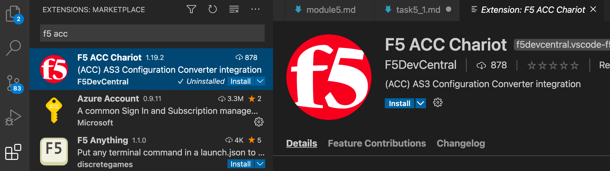
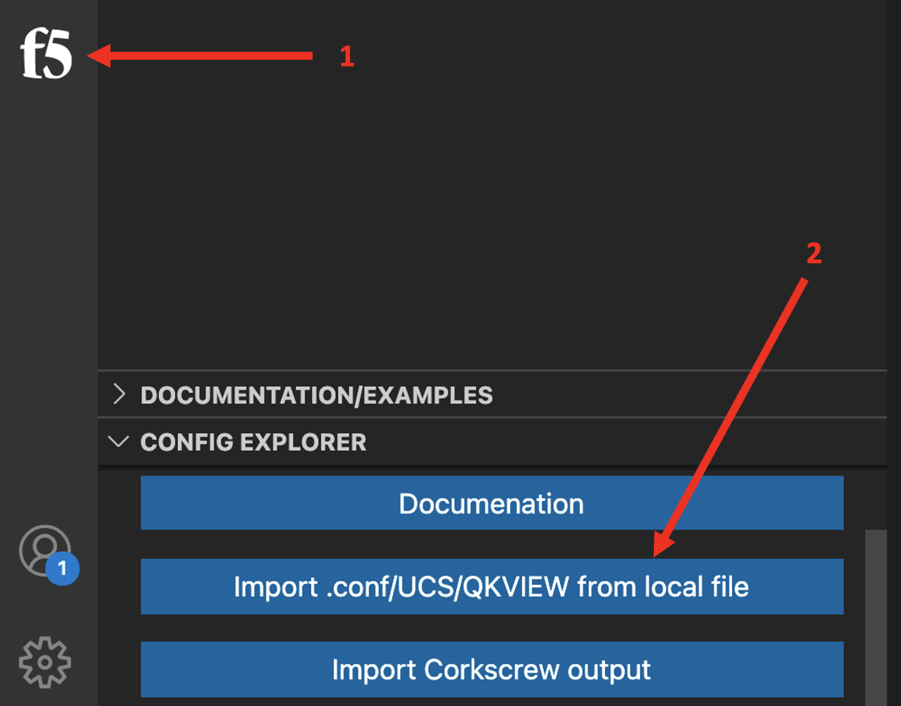
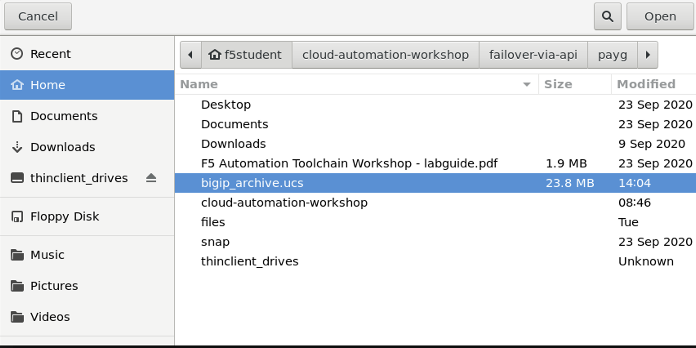
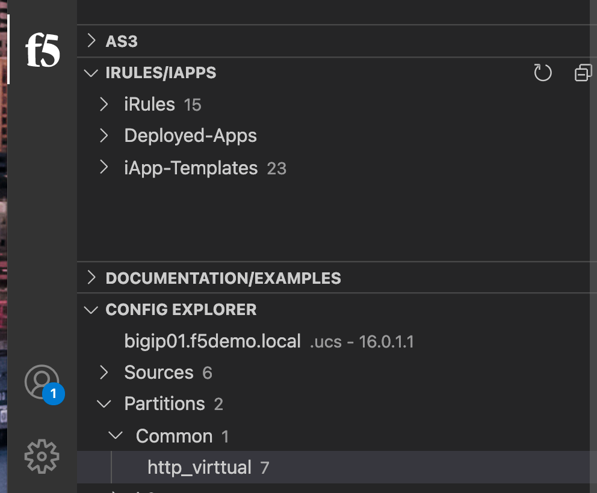
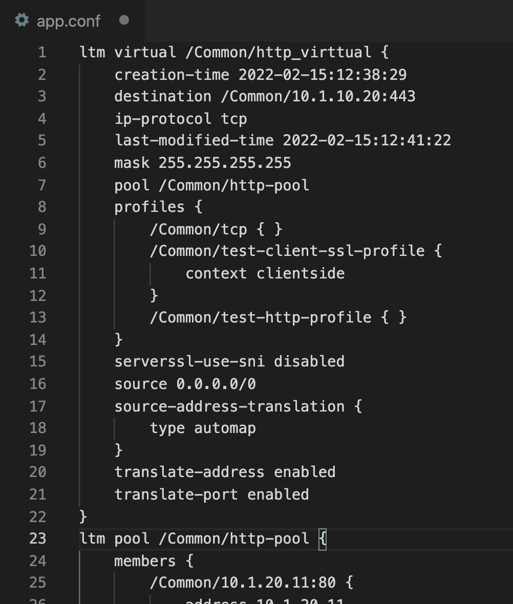
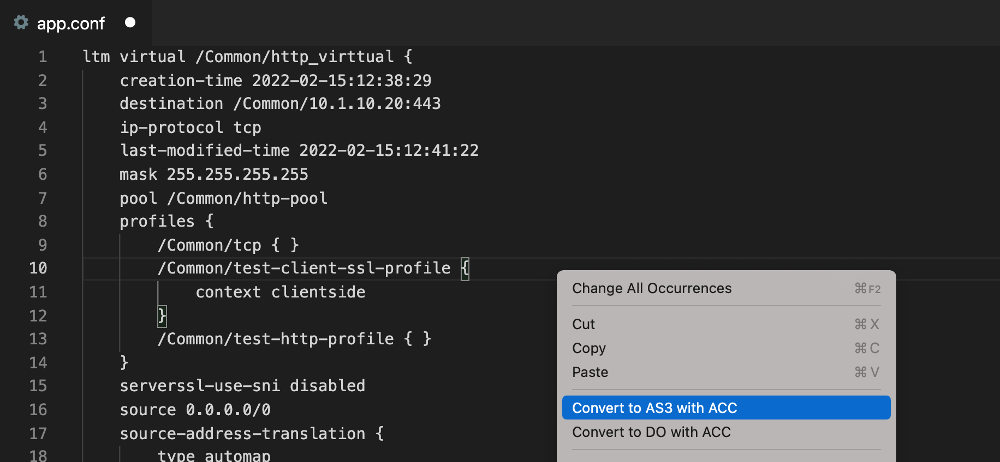
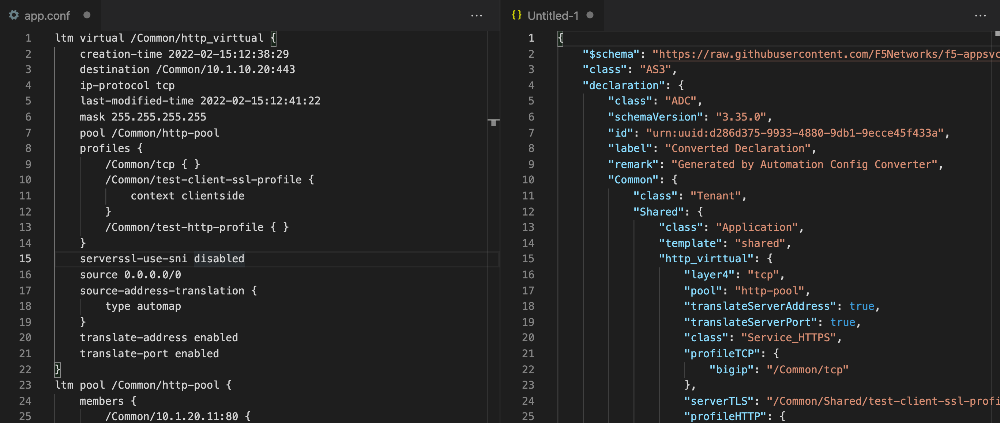
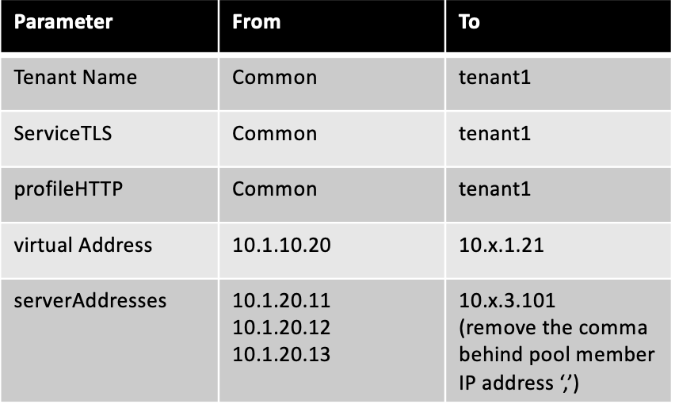
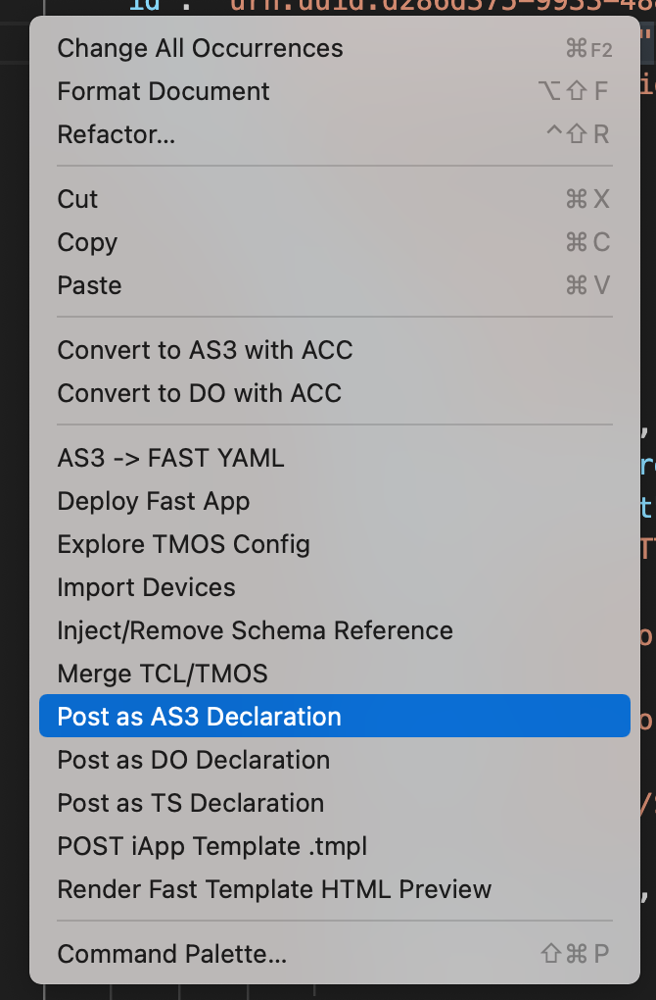
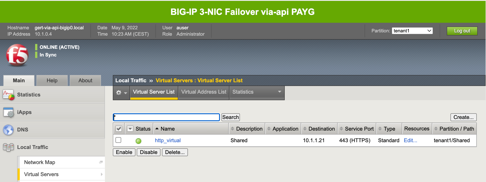

# 5.1 - Convert object-based BIG-IP configurations into AS3 declarations

This task will show how you can use existing applications which are 'object-based' configured and turn them into AS3 declarations.

**Step 1:** To use VSC to convert BIG-IP object configurations we need to install an additional F5 extension.

At the left side of VSC select **Extension** and type **'f5 acc'** in the search field and press enter.



**Step 2:** Select **F5 ACC Chariot** and install the extension.

**Step 3:** Import UCS file with the F5 Extension in VSC.



And go to folder **Home** and select  **bigip_archive.ucs** and select **Open**.



**Step 4:** Go the **Config Explorer** section of VSC and select **Partitions**, select **Common** and finally select **http_virtual**.



This opens another window called **app.conf** which includes a http_virtual application service.



(Omitted output)

**Step 5:** **Right-click** and select **Convert to AS3 with ACC**.



The object configuration gets converted into an AS3 declaration and you can compare both outputs.



(Omitted output)

**Step 6:** Before declaring the AS3 declaration let's make first some modifications.



```
Be sure:
* To change the 'x' to your student number
* Remove the ',' after the poolmember ip address entry
```

Save all changes to the AS3 declaration using Ctrl+s and give it the name **https_web_application.json**. It doesn't matter where the file gets saved, this is a don't care.


(Omitted output)

**Step 7:** Declare the AS3 template by right-clicking and selecting **POST as AS3 Declaration** and watch the response.



**Step 8:** Use the BIG-IP GUI to explore the just deployed AS3 declared application service.



## Summary
F5 Automation Config Converter (ACC) is part of the F5 Automation Toolchain family and can be leveraged to convert object-based BIG-IP configurations into DO and AS3 declarations. ACC creates a 1-to-1 translation from object-based into AS3 supported JSON syntax. 

ACC translates per application and this gives the ability to modify from Common to a tenant specific AS3 declaration.

[PREVIOUS](../module_5/module_5.md)      [NEXT](../module_6/module_6.md)