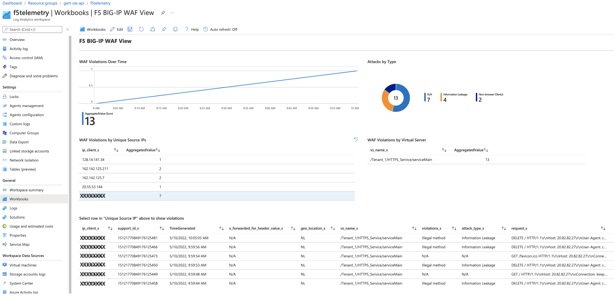

## 6.1 - BIG-IP Visibility and Analytics with Telemetry Streaming

With the wide adoption of REST-API to deploy and automate workloads, also the need for telemetry streaming via REST-API started to grow. Though SNMP has served us for three decades and will continue to do so, it is less known by devops teams and developers and therefore less suitable to be used within ephemiral deployments where insight in what gets consumed should be included.
Frankly, this counts for every production deployment, it should not go without a defined telemetry declaration.

## Telemetry Streaming
Being part of the F5 Automation Toolchain, Telemetry Streaming (TS) provides a solution to send metrics, alerts and event logs to an upstream consumer to makle these stats and events visible.

A detailed explanation and read can be found here: https://clouddocs.f5.com/products/extensions/f5-telemetry-streaming/latest/

Lets explore Telemetry Streaming in Azure.

**Step 1:** Go to VSC, select **onboard.tpl** and find the Telemetry Streaming (TS) declaration section.

Use the previous mentioned link to the Telemetry Streaming section on Clouddocs and notice the following:
* Use of telemetry streaming namespaces
* The definition of endpoints in the declaration.
* Use of Azure Application Insights and Azure Log Analytics as our consumer. Can you explain the difference? (If not Google it)

**Step 2:** Go to VSC and select **telemetry.tf** and how Terraform deploys een **f5telemetry** workspace and uses a template to create a workbook. Find the script of this workbook at the VSC left pane.

Remarks:
* The workbook comes straight from the F5 CSTv2 templates for Azure and creates a simple dashboard.
* The TS declaration in **onboard.tpl** is also a one to one copy from the CSTv2 templates.

**Step 3:** In VSC terminal go to the use case folder. From the **3-nic-basic-deployment** go to:

**cd ts-use-cases/6.1-telemetry-streaming/** (if you already haven't done so).

**Step 4:** Deploy the declaration by typing the following in the VSC terminal:

* **terraform init**
* **terraform plan**
* **terraform apply -auto-approve**

**Step 6:** Watch the generated Terraform output and use vip-2 to test the deployed application.

Check application vip-2 and refresh the page a couple of times:

**Step 7:** Go to your terminal and use a cURL DELETE to enforce to create some 'illigal' WAF entries.

**curl -sk -X DELETE https://(vip-2-pub-ip-address)**

And repeat this a couple of times.

**Step 8:** Go to your active BIG-IP and select the Virtual Server **ServiceMain** in **Tenant_1** and select **Security > Policies**.

Notice:
* The WAF policy attached.
* The Log profiles attached.

Use the **ts_use_case.tpl** to compare.

**Step 9:** On the BIG-IP, go to **Security > Event Logs > Application > Requests**.

Watch the log entries:

It shows you that both legal as illegal requests have hit the WAF policy.

**Step 10:** Go to the Azure Portal, select your resource group and select **f5telemetry > Workbook** and select the **F5 BIG-IP WAF View**

The **Dutch** flag is on purpose in the logging all the others are a spontanous catch.

**Step 11:** Watch the Workbook and please note that it can take up to 5 - 10 min before you will start to see log entries filling up the the charts. Press refresh from time to time and if you don't want to wait, continue with the next task but don't forget to return.

* When you scroll down below you will see that the system charts of **Instance Throughput** and **InstanceCPU** are visible. Remember that this was defined in the TS section of the **onboard.tpl** script.
* When you select the IP address at **WAF Violations by Unique Source IPs** the section below shows the violations in more detail.

[PREVIOUS](../module_6/module_6.md)      [NEXT](../module_6/task6_2.md)