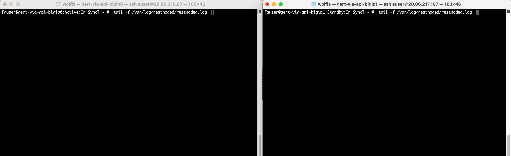
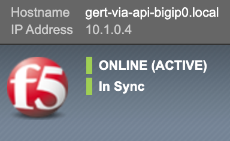
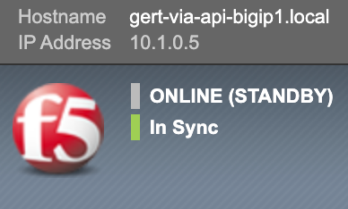
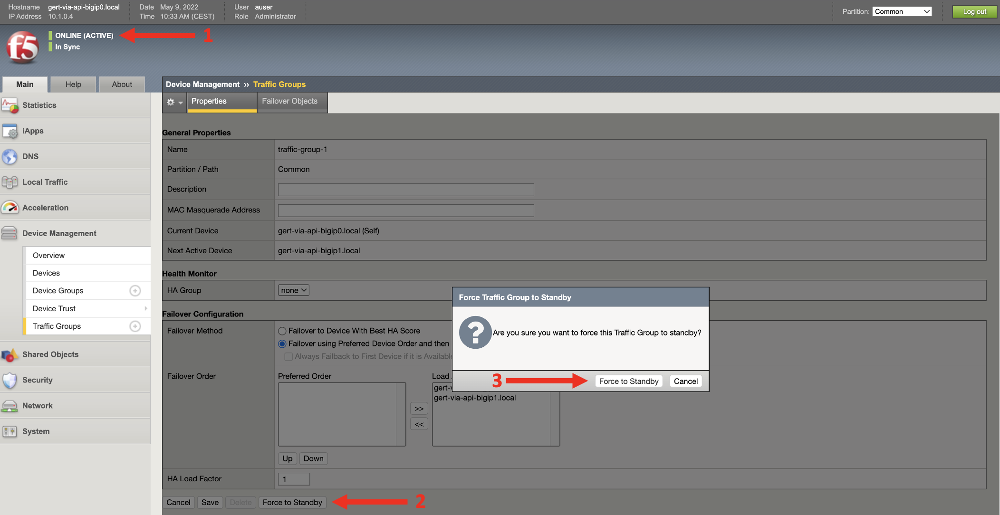
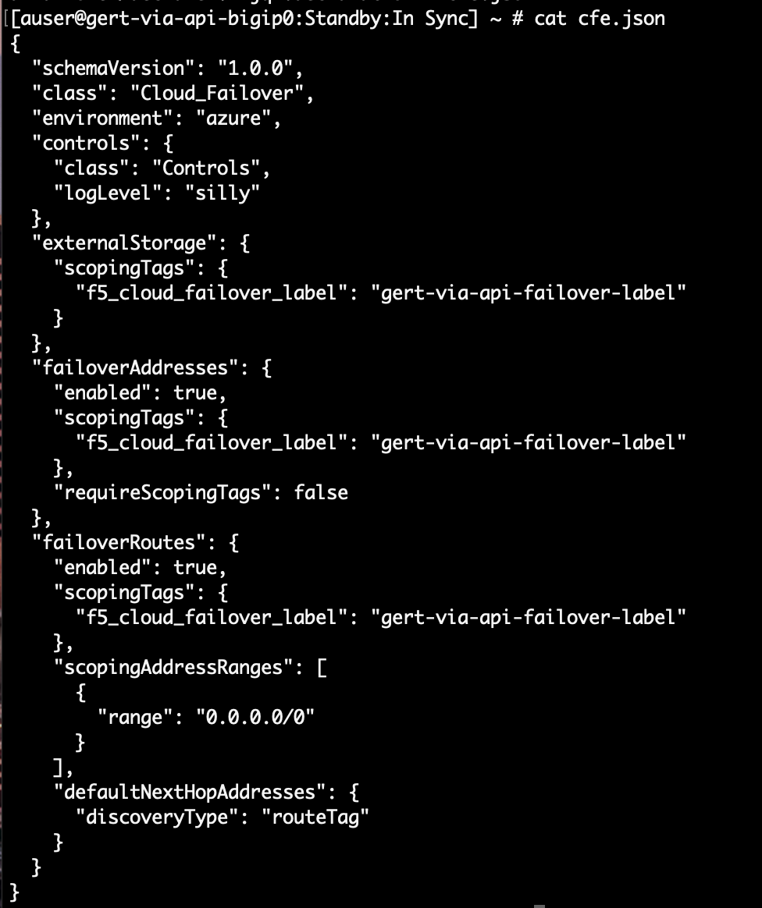

## 6.2 - BIG-IP Failover Testing

The BIG-IPs got deployed as a clustered solution using Cloud Failover Extension as the glue between the systems and the cloud environment.

Cloud Failover or CFE already has been explained in module 2. When you want to know the basic principle how CFE is working, you should read that module or use the oficial docs on https://clouddocs.f5.com.

This task will go through the testing of how Cloud failover functions during a failover.

**Step 1:** Use the deployed application from module 5 or when deleted, deploy an application with a VIP which has a secondary public IP attached.

* Test the application by grabbing the public IP of the virtual service, open a browser and see the test webpage by entering the public IP of the VIP.
* Use **terraform output** in folder **$ 3-nic-basic-deployment** to get the VIP IP values and which VIPs have an public IP address associated

**Step 2:** Open two terminals on the jumphost and login to both BIG-IPs by using SSH.

```
Note:
When you want to use your own laptop to login to the BIG-IPs that's okay.
```

**Step 3:** At both BIG-IP shell prompts type:

**tail -f /var/log/restnoded/restnoded.log**



Keep the terminals open since we will use it to track the failover process.

**Step 4:** Login to both BIG-IPs via the GUI and check which one is active and which one is passive.

 

and 



**Step 5:** Use your browser to go into te Azure portal and select the external NIC from the BIG-IP which is active. All secondary IP addesses should be attached to it. Leave this window open.


**Step 6:** Go to the **active** BIG-IP via the GUI and let it failover by selecting the **Online (Active)** in the left uppercorner and select **Force to Standby** and once more in the popped-up window.



**Step 7:** Go back to the Azure portal left open window of the BIG-IP External NIC and refresh the page.

Question:
* What happened with the secondary IP address 10.1.1.21 and its associated pubIP VIP address?
* Check the External NIC interface of the other BIG-IP. Are you able to find the secondary IP address here?

```
Note:
The Failover via-API in Azure taskes ~95s of failover time. 
This is far too long and not usable in production. 
Just be aware that both AWS and GCP do offer better failover times.
```

**Step 8:** Go back to your application in the browser and refresh it. 

Question:
* Did it get resolved?

**Step 9:** Go to your BIG-IP CLI open in the terminals and watch the logs.

Questions:
* Which BIG-IP is generating the failover messages, the one going from active to passive or the one going from passive into active modus?
* What are the messages saying?

```
Mon, 09 May 2022 08:40:48 GMT - info: [f5-cloud-failover] Disassociate NICs successful.
Mon, 09 May 2022 08:40:48 GMT - fine: [f5-cloud-failover] Associate IP configurations on nic name: gert-via-api-bigip1-ext-nic
Mon, 09 May 2022 08:40:48 GMT - finest: [f5-cloud-failover] Updating Network Interfaces
Mon, 09 May 2022 08:40:51 GMT - finest: socket 202 closed
Mon, 09 May 2022 08:41:19 GMT - info: [f5-cloud-failover] Associate NICs successful.
Mon, 09 May 2022 08:41:19 GMT - info: [f5-cloud-failover] Addresses reassociated successfully
Mon, 09 May 2022 08:41:19 GMT - finest: [f5-cloud-failover] Data will be uploaded to f5cloudfailoverstate.json: (output omitted)
Mon, 09 May 2022 08:41:19 GMT - info: [f5-cloud-failover] Failover Complete
Mon, 09 May 2022 08:41:21 GMT - severe: [f5-cloud-failover] Sending telemetry failed: Digital asset id of 98785d48-1e8b-5c9c-89b2-42cb9936f95c is already registered
```

**Step 10:** When you see the message **info: [f5-cloud-failover] Failover Complete** pass go to the Azure Portal to see if the secondary IPs got attached to the 'new' active BIG-IP external NIC interface.

**Step 11:** Test the application again by refreshing the page.

**Step 12:** (Optional) Perform a failover the other way around and you can repeat it a couple of times to understand the process Cloud Failover Extension provides to make an Active-Passive failover scenario possible with BIG-IP deployed in public cloud.

## CFE Declaration on BIG-IP
CFE uses a declaration to define what should be modified when a failover gets triggered. Though we have the CFE declaration as part of the BIG-IP Runtime-init and can be watched over there, lets check it out on the BIG-IP.

**Step 13:** Go to https://clouddocs.f5.com/products/extensions/f5-cloud-failover/latest/userguide/troubleshooting.html and download the CFE declared configuration.

**curl -su admin: -X GET http://localhost:8100/mgmt/shared/cloud-failover/declare |  jq .declaration > cfe.json**

and open with **cat cfe.json**



Notice:
* The used log level.
* The declared components of storage, failover addresses and failover routes.
* How IP address values are getting discovered.
* The Troubleshooting information on the opened clouddocs page.

Question:
* Is the declaration in cfe.json different from the declared file during runtime.init?

[PREVIOUS](../module_6/task6_1.md)


# END
